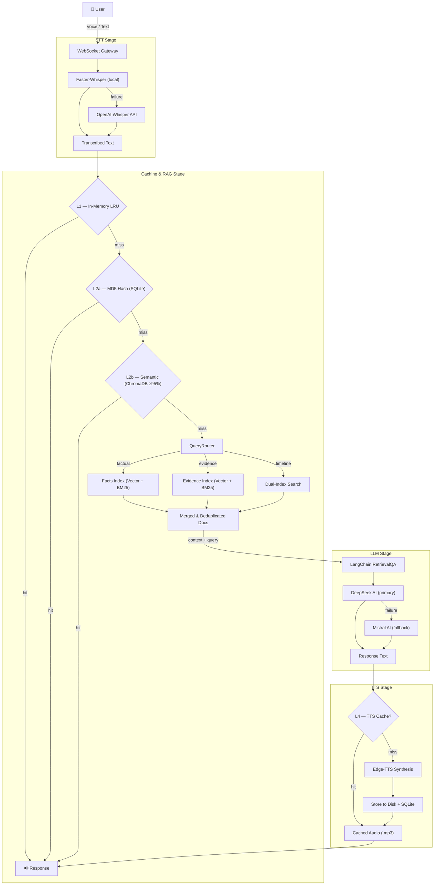
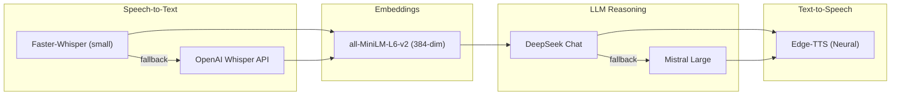

# 🎙️ EchoAI — Project Overview

> **Real-Time Voice-Driven Agentic Intelligence with RAG-Powered Memory & Multi-Level Caching**

---

## What Is EchoAI?

EchoAI is a real-time, voice-interactive AI assistant that creates natural conversations with an **AI clone**. Unlike traditional voice assistants, EchoAI **remembers** context through a Retrieval-Augmented Generation (RAG) knowledge layer, **reasons** over retrieved facts, and **adapts** responses based on a rich persona defined in structured data and evidence documents.

The system accepts voice or text input via WebSocket, processes it through a pipeline of **Speech-to-Text → RAG Retrieval → LLM Reasoning → Text-to-Speech**, and streams the audio response back in real time.

**Key differentiators:**

- 🧠 **Dual-index RAG** — Facts + Evidence knowledge bases searched via hybrid (vector + BM25) retrieval
- ⚡ **4-level caching** — Sub-millisecond responses for repeated or similar queries
- 🎤 **Real-time voice** — WebSocket-based streaming with neural TTS
- 🔄 **Auto-fallback** — Every pipeline stage has a fallback provider for resilience

---

## Caching Strategy with Different RAGs

EchoAI uses a **4-level caching hierarchy** that intercepts queries at the earliest possible point to minimise latency. Each level is backed by a different storage technology and RAG strategy.

### Cache Levels at a Glance

| Level | Name | Storage | Strategy | Latency |
|-------|------|---------|----------|---------|
| **L1** | In-Memory LRU | Python `dict` (max 1 000 entries) | Exact key match, auto-eviction | ~0 ms |
| **L2a** | Reply Cache — Hash | SQLite (`reply_cache` table) | MD5 hash of user text → exact O(1) lookup | < 1 ms |
| **L2b** | Reply Cache — Semantic | ChromaDB (`echoai_reply_cache`) | Cosine similarity ≥ 95 % via vector embeddings | ~5 ms |
| **L3** | Knowledge Base RAG | ChromaDB (`facts` + `evidence` indices) | Hybrid vector + BM25 search → LLM grounded answer | ~1–3 s |
| **L4** | TTS Audio Cache | SQLite metadata + disk files | Text hash → stored `.mp3` on disk | < 1 ms |

### How the Levels Interact

```
User Query
    │
    ▼
┌──────────────────────────────┐
│  L1 — In-Memory LRU Cache   │  •  dict lookup by normalised text
│  Hit? → instant return       │
└──────────┬───────────────────┘
           │ miss
           ▼
┌──────────────────────────────┐
│  L2a — MD5 Hash (SQLite)     │  •  O(1) exact match via hash
│  Hit? → cached response + ♪  │
└──────────┬───────────────────┘
           │ miss
           ▼
┌──────────────────────────────┐
│  L2b — Semantic (ChromaDB)   │  •  cosine similarity ≥ 95 %
│  Hit? → similar response + ♪ │  •  uses all-MiniLM-L6-v2 embeddings
└──────────┬───────────────────┘
           │ miss
           ▼
┌──────────────────────────────┐
│  L3 — Knowledge Base RAG     │  •  QueryRouter classifies intent
│  Hybrid search (vector+BM25) │  •  dual-index: facts + evidence
│  → Grounded LLM answer       │  •  temperature locked to 0
└──────────┬───────────────────┘
           │ response text
           ▼
┌──────────────────────────────┐
│  L4 — TTS Audio Cache        │  •  text hash → disk .mp3
│  Hit? → load cached audio    │     miss → Edge-TTS synthesis
└──────────────────────────────┘
```

### RAG Knowledge Collections

EchoAI maintains **three separate ChromaDB collections**, each serving a distinct purpose:

| Collection | Purpose | Data Source | Chunking |
|-----------|---------|-------------|----------|
| `echoai_reply_cache` | Cache previous Q&A pairs for reuse | Runtime conversations | One doc per Q&A |
| `echoai_self_info_facts` | Atomic personal/professional facts | `self_info.json` | One doc per Q&A record |
| `echoai_self_info_evidence` | Detailed project & career evidence | GitHub READMEs, CV (.docx), LinkedIn CSVs | Header-aware (MD), paragraph (DOCX), row-based (CSV) |

**Query Router** — A deterministic, no-LLM router classifies queries by intent and picks the right index:

| Intent | Example | Primary Index |
|--------|---------|---------------|
| Factual | *"What is your email?"* | Facts |
| Evidence | *"Describe the ApplyBots project"* | Evidence |
| Timeline | *"Walk me through your career"* | Both (facts + evidence) |
| Default | General questions | Facts |

---

## End-to-End Workflow Diagram



---

## ML Models Used

The table below lists **every ML model** used across the EchoAI pipeline, its provider, and what it does.

| # | Model | Provider | Role | Details |
|---|-------|----------|------|---------|
| 1 | **Faster-Whisper `small`** | CTranslate2 (local) | **Speech-to-Text (primary)** | Runs locally with CTranslate2 optimisations for low-latency transcription. Processes 16 kHz mono audio with configurable chunk duration (2 s). Automatic fallback to OpenAI Whisper on failure. |
| 2 | **OpenAI Whisper API** | OpenAI | **Speech-to-Text (fallback)** | Cloud-based STT activated if Faster-Whisper fails. Uses the same audio format. Timeout: 5 s. |
| 3 | **all-MiniLM-L6-v2** | SentenceTransformers / Hugging Face | **Text Embeddings** | 384-dimensional embedding model used for all vector operations — reply cache similarity, facts index, and evidence index in ChromaDB (HNSW cosine space). Sub-50 ms search latency. |
| 4 | **DeepSeek Chat (`deepseek-chat`)** | DeepSeek AI | **LLM — Response Generation (primary)** | Primary language model for reasoning over retrieved context via LangChain `RetrievalQA` with `stuff` chain type. Temperature locked to 0 for grounded, deterministic answers. Max response: 1 000 chars. Timeout: 10 s. |
| 5 | **Mistral Large (`mistral-large-latest`)** | Mistral AI | **LLM — Response Generation (fallback)** | Automatic fallback LLM triggered if DeepSeek fails. Same chain and prompt configuration. |
| 6 | **Edge-TTS (Microsoft Neural Voices)** | Microsoft (free, no API key) | **Text-to-Speech** | Neural voice synthesis using `en-IN-PrabhatNeural` (configurable). Supports streaming chunk synthesis for low first-byte latency. Output cached to disk as `.mp3`. Timeout: 8 s. |

### Model Interaction in the Pipeline



---

## Tech Stack Summary

| Layer | Technologies |
|-------|-------------|
| **Frontend** | Next.js 16, React 19, TypeScript 5, Tailwind CSS 4 |
| **Backend** | FastAPI, WebSocket, asyncio |
| **RAG / AI** | LangChain 0.3+, ChromaDB, SentenceTransformers |
| **Databases** | SQLite (local cache), Supabase PostgreSQL (cloud), ChromaDB (vectors) |
| **ML** | PyTorch, Transformers, Faster-Whisper, Edge-TTS |
| **Infra** | Docker, Railway |

---

*Generated: 2025-02-24  •  EchoAI v1.0*
