# 🎙️ EchoAI – Real-Time Voice-Driven Agentic Intelligence

> **Next-Generation Human-AI Interaction Through Autonomous Voice Conversations with RAG-Powered Memory & Knowledge Retrieval**

[](https://github.com/AteetVatan/echo-ai)
[](https://github.com/AteetVatan/echo-ai)
[](https://opensource.org/licenses/MIT)
[](https://www.python.org/downloads/)
[](https://hub.docker.com/)
[](https://fastapi.tiangolo.com/)
[](https://websockets.readthedocs.io/)
[](https://arxiv.org/abs/2005.11401)
[](https://langchain.com/)
[](https://github.com/rany2/edge-tts)

**🔗 Repository:** [https://github.com/AteetVatan/echo-ai](https://github.com/AteetVatan/echo-ai)

---

## 📖 Table of Contents

- [Project Overview](#-project-overview)
- [Key Features](#-key-features)
- [Architecture Overview](#-architecture-overview)
- [System Architecture Diagram](#-system-architecture-diagram)
- [RAG System Deep Dive](#-rag-system-deep-dive)
- [RAG Pipeline Flow Diagram](#-rag-pipeline-flow-diagram)
- [Agent Collaboration Workflow](#-agent-collaboration-workflow)
- [Service Layer Architecture](#-service-layer-architecture)
- [Design Patterns](#-design-patterns)
- [Frontend Architecture](#-frontend-architecture)
- [Exception Hierarchy](#-exception-hierarchy)
- [WebSocket Protocol Diagram](#-websocket-protocol-diagram)
- [Technology Stack](#-technology-stack)
- [Project Structure](#-project-structure)
- [How It Works](#-how-it-works)
- [Installation](#-installation)
- [How to Run](#️-how-to-run)
- [API Endpoints](#-api-endpoints)
- [Usage Examples](#-usage-examples)
- [Configuration Reference](#-configuration-reference)
- [Performance Metrics](#-performance-metrics)
- [Troubleshooting](#-troubleshooting)
- [Future Roadmap](#-future-roadmap)
- [Contributing](#-contributing)
- [License](#️-license)
- [Acknowledgments](#-acknowledgments)
- [Support & Community](#-support--community)

---

## 🌟 Project Overview

**EchoAI** is a cutting-edge, real-time voice-interactive AI system that enables natural, autonomous conversations with an AI clone. Built on the principles of **agentic intelligence** and **Retrieval-Augmented Generation (RAG)**, EchoAI combines real-time speech processing, semantic memory retrieval, and autonomous reasoning to create the most natural human-AI interaction experience possible.

### Why EchoAI Matters

Traditional voice assistants are reactive and lack contextual memory. EchoAI represents the next evolution: an AI that can:
- **Remember** previous conversations and build long-term relationships through RAG-powered semantic search
- **Reason** autonomously about complex topics using retrieved knowledge
- **Adapt** its personality and responses based on interaction history and stored knowledge
- **Learn** from conversations to improve future interactions with persistent memory

This project pushes the boundaries of what's possible in human-AI communication, making AI interactions feel truly natural and meaningful through intelligent knowledge retrieval and context-aware responses.

---

## 🚀 Key Features

### 🎤 Real-Time Voice Processing
- **Ultra-low latency STT** using Faster-Whisper (local) with OpenAI Whisper fallback
- **Instant TTS synthesis** with Edge-TTS (Microsoft neural voices — free, no API key)
- **Audio streaming** via WebSocket for natural conversational flow
- **Audio chunking & normalization** with tail-padding and RMS-based gain control
- **Multi-mode audio input**: complete audio, streaming chunks, and real-time buffered streams

### 🧠 RAG-Powered Intelligence
- **Semantic vector search** using ChromaDB with cosine similarity (HNSW space)
- **Self-Info Knowledge Base** loaded and indexed from `self_info.json` (career, skills, projects, personality)
- **Reply Cache System** with dual-layer matching: MD5 hash exact match → semantic similarity fallback
- **Context-aware responses** with multi-turn conversation history (configurable window size)
- **Intelligent caching** with configurable similarity thresholds (95% semantic cache, 85% reply cache)
- **Text splitting** with LangChain `RecursiveCharacterTextSplitter` (chunk size 500, overlap 50)

### 🤖 Agentic Architecture
- **Multi-LLM orchestration**: DeepSeek AI (primary) with Mistral AI (fallback)
- **LangChain RAG chain** using `RetrievalQA` with `stuff` chain type
- **Custom persona prompt** for personality-consistent responses
- **Autonomous reasoning** with graceful fallback mechanisms
- **Session-based conversation management** with unique session IDs

### ⚡ Performance Optimizations
- **WebSocket streaming** for real-time bidirectional audio transmission
- **Concurrent async processing** with `asyncio`-based architecture throughout
- **Multi-level caching**: in-memory LRU cache → SQLite audio cache → ChromaDB vector cache
- **Cache warm-up** on startup with common phrases
- **Performance monitoring** with per-component latency tracking and statistics
- **Configurable timeouts** for STT (5s), LLM (10s), TTS (8s)

### 🛡️ Robustness & Error Handling
- **Typed exception hierarchy**: `EchoAIError` → `STTError`, `LLMError`, `TTSError`, `RAGError`, `PipelineError`, `DatabaseError`, `AudioProcessingError`
- **Automatic LLM fallback** from DeepSeek → Mistral on failure
- **Automatic STT fallback** from Faster-Whisper → OpenAI Whisper on failure
- **MockVectorStore** fallback when ChromaDB initialization fails
- **Connection management** with graceful WebSocket disconnect/cleanup

### 💾 Dual Database Architecture
- **SQLite** for local audio cache and reply metadata (zero-config, always available)
- **Supabase PostgreSQL** for cloud-based persistent storage with connection pooling (`asyncpg`)
- **ChromaDB** as vector database for semantic search (persisted to disk)

### 🖥️ Frontend Web Client (Next.js 16)
- **Next.js 16 + React 19 + TypeScript 5** — modern App Router with server/client components
- **Tailwind CSS 4** — utility-first responsive styling with glassmorphism and micro-animations
- **12 TSX components** across 3 domains: Chat (ChatContainer, ChatInput, MessageBubble, TypingIndicator), Home (HeroSection, FeaturesSection, StatsBar, AIVisualization, NeuralBackground), Layout (Header, Footer, LayoutShell)
- **Custom `useChat` hook** — encapsulates WebSocket lifecycle, message state, audio recording/playback, and voice toggle
- **Real-time WebSocket** communication with visual status indicators
- **Responsive design** — optimised for mobile (320px–768px), tablet (768px–1024px), and desktop

---

## 🏗 Architecture Overview

> 📁 **Standalone Mermaid diagrams** are available in [`docs/diagrams/`](docs/diagrams/) as `.mmd` files for use in external tools, CI pipelines, or documentation generators.

### System Architecture Diagram


---

### Service Layer Architecture


---

### Data Flow Architecture

```mermaid
flowchart TD
    subgraph "Input Processing"
        IN1[WebSocket Audio] --> DECODE[Audio Decode & Normalize]
        IN2[Text Message] --> DIRECT[Direct Text Input]
        IN3[Streaming Buffer] --> ACCUMULATE[Chunk Accumulator]
        ACCUMULATE --> DECODE
    end

    subgraph "STT Stage"
        DECODE --> FW[Faster-Whisper Local]
        FW -->|Failure| OW[OpenAI Whisper API]
        FW --> TEXT[Transcribed Text]
        OW --> TEXT
    end

    subgraph "RAG Stage"
        TEXT --> RC{Reply Cache Lookup}
        DIRECT --> RC
        RC -->|Exact Hash Match| HIT[Cache Hit]
        RC -->|Semantic ≥95%| HIT
        RC -->|Miss| QR[Query Router]
        QR -->|factual/default| FACTS[Facts Index Search]
        QR -->|evidence| EVIDENCE[Evidence Index Search]
        QR -->|timeline/both| BOTH[Dual-Index Search]
        FACTS --> MERGE[Hybrid Merge — Vector + BM25]
        EVIDENCE --> MERGE
        BOTH --> MERGE
        MERGE -->|Relevant Docs| RAGCHAIN[LangChain RetrievalQA]
        MERGE -->|No Docs| DIRECTLLM[Direct LLM Call]
    end

    subgraph "LLM Stage"
        RAGCHAIN --> DS[DeepSeek AI Primary]
        DIRECTLLM --> DS
        DS -->|Failure| MI[Mistral AI Fallback]
        DS --> RESP[Response Text]
        MI --> RESP
    end

    subgraph "TTS Stage"
        RESP --> TC{TTS Cache Check}
        TC -->|Cached| CAUDIO[Cached Audio]
        TC -->|Miss| EDGE[Edge-TTS Synthesis]
        EDGE --> NAUDIO[New Audio]
        NAUDIO --> STORE[Store in Cache]
    end

    subgraph "Output"
        HIT --> WS[WebSocket Response]
        CAUDIO --> WS
        NAUDIO --> WS
        STORE --> SQLITE[(SQLite DB)]
        STORE --> CHROMA[(ChromaDB)]
    end
```



---

## 🔍 RAG System Deep Dive

### Core RAG Components

#### 1. Semantic Vector Search
- **Embedding Model**: `SentenceTransformer` (`all-MiniLM-L6-v2`)
- **Vector Database**: ChromaDB with `hnsw:space = cosine`
- **Search Strategy**: Hybrid — vector similarity + BM25 keyword matching with configurable `k`
- **Collections**:
  - `echoai_reply_cache` — reply caching for fast audio reuse
  - `echoai_self_info_facts` — atomic Q&A records from `self_info.json`
  - `echoai_self_info_evidence` — chunked evidence documents (READMEs, CV, LinkedIn CSVs)
- **Performance**: Sub-50ms similarity search latency

#### 2. Dual-Index Knowledge Base Architecture

The knowledge base uses a **dual-index** strategy with separate Chroma collections:

| Index | Collection | Source | Chunking |
|-------|-----------|--------|----------|
| **Facts** | `echoai_self_info_facts` | `self_info.json` — atomic Q&A records | One document per Q&A pair |
| **Evidence** | `echoai_self_info_evidence` | READMEs, CV, LinkedIn CSVs | Header-aware (MD: 1000/150), paragraph (DOCX: 800/100), row-based (CSV) |

**Self-Info JSON Schema** — The facts index is loaded from a structured `self_info.json` file containing:
- Personal information & professional bio
- Career history & work experience
- Technical skills & expertise
- Featured projects & portfolio
- Education & certifications
- Contact information
- Personality traits & communication style

**Evidence Vault** — The evidence index ingests multi-format documents from `rag_persona_db/document/`:
- 📄 **Markdown** (`.md`) — GitHub project READMEs (ApplyBots, Galileo, ShotGraph, MASX-*, MedAI)
- 📝 **DOCX** — CV / resume documents
- 📊 **CSV** — LinkedIn data exports (skills, projects, endorsements, languages, learning)
- 📑 **PDF** — Additional documents (via PyPDF fallback)

All documents receive deterministic `stable_id` values (SHA-256 for facts, MD5 for evidence) enabling clean upserts without duplication.

#### 3. Deterministic Query Router

The `QueryRouter` classifies user queries **without any LLM call** using keyword matching and intent patterns:

| Query Type | Primary Index | Example Queries |
|-----------|--------------|----------------|
| **Factual** | Facts | "What is your email?", "Tell me about your skills" |
| **Evidence** | Evidence | "Show me the ApplyBots project", "Describe your CV" |
| **Timeline** | Both | "Walk me through your career path", "Overview of all projects" |
| **Default** | Facts | General queries without strong intent signals |

The router scores each category via regex pattern lists and selects primary + secondary indices. If the primary index returns insufficient results, the secondary is queried to supplement.

#### 4. Hybrid Retrieval

The `SelfInfoRetriever` combines two search strategies:
1. **Vector similarity search** — cosine similarity via ChromaDB (`k=4` default)
2. **BM25 keyword search** — exact keyword matching over the same document collection

Results are merged with vector-first ordering, deduplicated by `stable_id`, and post-filtered by `doc_type` and `tags` metadata. If filtering reduces results below `k`, an expanded search is triggered.

#### 5. Grounded Answer Generation

The `SelfInfoRAG` module generates answers with strict grounding rules:
- Temperature **hard-locked to 0** (defence-in-depth)
- Uses **ONLY** retrieved context — never invents facts
- If context is insufficient → explicit refusal: *"I don't have that information in my self_info knowledge base."*
- Returns structured output: `answer`, `key_facts`, `sources`, `route`

### Knowledge Layer Architecture

```mermaid
flowchart TD
    subgraph "Data Sources"
        JSON["self_info.json"]
        README_FILES["GitHub READMEs"]
        CV["CV / .docx"]
        CSV["LinkedIn CSVs"]
    end

    subgraph "Loaders"
        SIL["SelfInfoLoader + Pydantic"]
        EL["EvidenceLoader MD/DOCX/CSV/PDF"]
    end

    subgraph "Dual-Index Vector Store"
        FACTS_IDX[("ChromaDB Facts")]
        EVIDENCE_IDX[("ChromaDB Evidence")]
    end

    subgraph "Query Processing"
        QR["QueryRouter — No LLM"]
        RET["Hybrid: Vector + BM25"]
        RAG["Grounded RAG Chain — temp=0"]
    end

    JSON --> SIL --> FACTS_IDX
    README_FILES & CV & CSV --> EL --> EVIDENCE_IDX
    QR --> RET --> FACTS_IDX & EVIDENCE_IDX
    RET --> RAG --> OUTPUT["answer, key_facts, sources, route"]
```



#### 6. Reply Caching System
- **Dual-layer lookup**:
  - **Hash-based**: MD5 hash for exact text match (O(1) lookup via SQLite)
  - **Semantic search**: Cosine similarity ≥ 85% threshold via ChromaDB
- **Storage**: SQLite `reply_cache` table + ChromaDB `echoai_reply_cache` vector embeddings
- **Deterministic IDs**: `MD5(user_text)` used for both SQLite and Chroma `vector_id` to enable clean upserts
- **Audio file reuse**: Cached audio files are stored on disk and referenced by path

### Multi-Level Caching Strategy

```mermaid
flowchart TD
    INPUT["User Query"] --> L1

    subgraph "Level 1 — In-Memory LRU"
        L1{"In-Memory Dict (max 1000)"}
        L1 -->|Hit| L1_HIT["Instant Return ~0ms"]
        L1 -->|Miss| L2
    end

    subgraph "Level 2 — Reply Cache"
        L2{"MD5 Hash Lookup (SQLite)"}
        L2 -->|Exact Match| L2_HIT["Cached Response + Audio"]
        L2 -->|Miss| L3
        L3{"Semantic Search (ChromaDB ≥95%)"}
        L3 -->|Hit| L3_HIT["Similar Response + Audio"]
        L3 -->|Miss| KB
    end

    subgraph "Level 3 — Knowledge Base RAG"
        KB["Query Router → Hybrid Search → LLM"]
    end

    subgraph "Level 4 — TTS Audio Cache"
        KB --> TTS_CHECK{"Audio Cached?"}
        TTS_CHECK -->|Hit| TTS_HIT["Load from Disk"]
        TTS_CHECK -->|Miss| TTS_GEN["Edge-TTS Synthesis → Store"]
    end

    L1_HIT & L2_HIT & L3_HIT & TTS_HIT & TTS_GEN --> RESPOND["🔊 Response"]
```



---

### RAG Pipeline Flow Diagram


---

## 🖼 Agent Collaboration Workflow

```mermaid
sequenceDiagram
    participant User
    participant STT_Agent
    participant RAG_Agent
    participant Search_Agent
    participant Knowledge_Agent
    participant Reasoning_Agent
    participant TTS_Agent
    participant Memory_Layer

    User->>STT_Agent: 🎤 Voice Input
    STT_Agent->>STT_Agent: Audio → Text
    STT_Agent->>RAG_Agent: Processed Text
    
    RAG_Agent->>Search_Agent: Initiate Semantic Search
    Search_Agent->>Memory_Layer: Vector Database Query
    Memory_Layer-->>Search_Agent: Similar Responses
    
    alt Cache Hit
        Search_Agent->>TTS_Agent: Retrieve Cached Audio
        TTS_Agent->>User: 🎵 Instant Response
    else No Cache
        Search_Agent->>Knowledge_Agent: Search Self-Info
        Knowledge_Agent->>Memory_Layer: Knowledge Base Query
        Memory_Layer-->>Knowledge_Agent: Relevant Knowledge
        
        alt Knowledge Available
            Knowledge_Agent->>Reasoning_Agent: RAG Chain Processing
            Reasoning_Agent->>Reasoning_Agent: Context + Knowledge Assembly
            Reasoning_Agent->>Reasoning_Agent: LLM Reasoning
            Reasoning_Agent->>TTS_Agent: Generated Response
        else No Knowledge
            Knowledge_Agent->>Reasoning_Agent: Direct LLM Generation
            Reasoning_Agent->>TTS_Agent: Generated Response
        end
        
        TTS_Agent->>TTS_Agent: Text → Audio
        TTS_Agent->>User: 🎵 Synthesized Response
        RAG_Agent->>Memory_Layer: Store New Interaction
    end
```



---

## 🧩 Design Patterns

EchoAI employs several well-known software design patterns to achieve modularity, resilience, and performance.

> 📁 **Standalone diagram:** [`docs/diagrams/design_patterns.mmd`](docs/diagrams/design_patterns.mmd)

| Pattern | Implementation | Purpose |
|---------|---------------|---------|
| **Pipeline** | `VoicePipeline` | Chains STT → RAG → LLM → TTS as sequential stages; each stage is independently replaceable |
| **Strategy** | `STTService`, `LLMService` | Runtime selection between primary (Faster-Whisper / DeepSeek) and fallback (OpenAI Whisper / Mistral) providers — swap without changing callers |
| **Repository** | `DBOperations`, `DBOperationsPostgres`, `SelfInfoVectorStore` | Abstracts storage behind a uniform interface (SQLite, PostgreSQL, ChromaDB) |
| **Facade** | `SelfInfoRAG` | Exposes a single `query()` entrypoint that internally orchestrates `QueryRouter`, `SelfInfoRetriever`, `SelfInfoVectorStore`, and `EvidenceLoader` |
| **Observer** | `ConnectionManager` | Manages N WebSocket connections; broadcasts events and handles per-session lifecycle |
| **Cache-Aside** | `ReplyCacheManager`, `TTSService` | Four-level cache hierarchy (In-Memory LRU → MD5 Hash → Semantic → TTS Disk) each checked before computation |
| **Chain of Responsibility** | `QueryRouter` | Classifies queries into `factual`, `evidence`, `timeline`, or `default` routes — each handler tries its index before forwarding |
| **Template Method** | `EchoAIError` hierarchy | Base exception defines the contract; `STTError`, `LLMError`, `TTSError`, etc. specialise the error type |

```mermaid
flowchart LR
    subgraph "Pipeline Pattern"
        PP1["VoicePipeline"]
        PP2["STT → RAG → LLM → TTS"]
        PP1 --> PP2
    end

    subgraph "Strategy Pattern"
        SP1["STT Strategy"]
        SP2["Faster-Whisper"]
        SP3["OpenAI Whisper"]
        SP4["LLM Strategy"]
        SP5["DeepSeek AI"]
        SP6["Mistral AI"]
        SP1 --> SP2 & SP3
        SP4 --> SP5 & SP6
    end

    subgraph "Facade Pattern"
        FP1["SelfInfoRAG"]
        FP2["QueryRouter"]
        FP3["SelfInfoRetriever"]
        FP4["SelfInfoVectorStore"]
        FP5["EvidenceLoader"]
        FP1 --> FP2 & FP3 & FP4 & FP5
    end

    subgraph "Cache-Aside Pattern"
        CP1["L1: In-Memory LRU"]
        CP2["L2: MD5 Hash — SQLite"]
        CP3["L3: Semantic — ChromaDB"]
        CP4["L4: TTS Audio Disk"]
        CP1 --> CP2 --> CP3 --> CP4
    end

    subgraph "Chain of Responsibility"
        CR1["QueryRouter"]
        CR2["Factual → Facts Index"]
        CR3["Evidence → Evidence Index"]
        CR4["Timeline → Both Indices"]
        CR1 --> CR2 & CR3 & CR4
    end
```



---

## 🌐 Frontend Architecture

The frontend is a **Next.js 16** application using the **App Router**, **React 19**, **TypeScript 5**, and **Tailwind CSS 4**. All real-time communication flows through a custom `useChat` hook that manages WebSocket lifecycle, message state, and audio recording/playback.

> 📁 **Standalone diagram:** [`docs/diagrams/frontend_architecture.mmd`](docs/diagrams/frontend_architecture.mmd)

### Component Hierarchy

```mermaid
flowchart TD
    subgraph "Next.js App Router"
        LAYOUT["layout.tsx — RootLayout"]
        SHELL["LayoutShell — Header + Footer wrapper"]
        HOME_PAGE["page.tsx — Landing Page"]
        CHAT_PAGE["chat/page.tsx — Chat Page"]
        ERROR["error.tsx — Error Boundary"]
    end

    subgraph "Landing Page Components"
        HERO["HeroSection — CTA + Animated text"]
        FEATURES["FeaturesSection — Feature cards grid"]
        STATS["StatsBar — Live statistics counters"]
        NEURAL["NeuralBackground — Canvas particle animation"]
        AIVIZ["AIVisualization — 3D-style AI visual"]
    end

    subgraph "Chat Components"
        CONTAINER["ChatContainer — Main chat orchestrator"]
        INPUT["ChatInput — Text + voice input bar"]
        BUBBLE["MessageBubble — User/AI message display"]
        TYPING["TypingIndicator — AI thinking animation"]
    end

    subgraph "Shared Layout"
        HEADER["Header — Navigation + branding"]
        FOOTER["Footer — Links + credits"]
    end

    subgraph "Data Layer"
        HOOK["useChat Hook — WebSocket + state management"]
        API_LIB["lib/api.ts — API base URL config"]
        TYPES["lib/types.ts — TypeScript interfaces"]
    end

    subgraph "Backend Connection"
        WS["WebSocket ws://host:8000/ws/{sessionId}"]
        REST["REST API http://host:8000/api/*"]
    end

    LAYOUT --> SHELL
    SHELL --> HEADER & FOOTER
    LAYOUT --> HOME_PAGE & CHAT_PAGE & ERROR

    HOME_PAGE --> HERO & FEATURES & STATS
    HOME_PAGE --> NEURAL & AIVIZ

    CHAT_PAGE --> CONTAINER
    CONTAINER --> INPUT & BUBBLE & TYPING
    CONTAINER --> HOOK

    HOOK --> WS
    HOOK --> API_LIB
    HOOK --> TYPES
    API_LIB --> REST
```



### Frontend Technology Stack

| Layer | Technology | Details |
|-------|-----------|---------|
| **Framework** | Next.js 16.1.6 | App Router with server/client components |
| **Rendering** | React 19.2.3 | Concurrent features, server components |
| **Language** | TypeScript 5 | Full type safety across components |
| **Styling** | Tailwind CSS 4 | Utility-first with glassmorphism effects |
| **State** | `useChat` custom hook | WebSocket, messages, audio, voice toggle |
| **Build** | PostCSS + SWC | Lightning-fast compilation |
| **Linting** | ESLint 9 (flat config) | `eslint-config-next` rule set |

---

## 🚨 Exception Hierarchy

All service, agent, and pipeline code raises typed exceptions from a single hierarchy rooted in `EchoAIError`. Callers catch specific subtypes to implement fallback behaviour.

> 📁 **Standalone diagram:** [`docs/diagrams/exception_hierarchy.mmd`](docs/diagrams/exception_hierarchy.mmd)


---

## 📡 WebSocket Protocol Diagram

Visual diagram of the full WebSocket message lifecycle — connection, audio modes, text chat, and keep-alive.

> 📁 **Standalone diagram:** [`docs/diagrams/websocket_protocol.mmd`](docs/diagrams/websocket_protocol.mmd)


---

## 🧰 Technology Stack

| Category | Technology | Purpose |
|----------|-----------|---------|
| **Frontend Framework** | Next.js 16.1.6 (App Router) | React-based SSR/SSG framework |
| **UI Library** | React 19.2.3 + React DOM | Component-based UI rendering |
| **Language (Frontend)** | TypeScript 5 | Static typing for frontend code |
| **Styling** | Tailwind CSS 4 | Utility-first CSS framework |
| **Web Framework** | FastAPI 0.104+ | REST API + WebSocket server |
| **Primary LLM** | DeepSeek AI (`deepseek-chat`) | Main language model for response generation |
| **Fallback LLM** | Mistral AI (`mistral-large-latest`) | Fallback language model |
| **RAG Framework** | LangChain 0.3+ | RAG pipeline, chains, and retrieval |
| **Vector Database** | ChromaDB 0.4+ | Semantic vector storage and similarity search |
| **Embeddings** | SentenceTransformers (`all-MiniLM-L6-v2`) | Text embedding generation |
| **STT (Primary)** | Faster-Whisper (`small` model) | Local speech-to-text |
| **STT (Fallback)** | OpenAI Whisper API | Cloud STT fallback |
| **TTS** | Edge-TTS (Microsoft Neural Voices) | Free text-to-speech synthesis |
| **Local Database** | SQLite | Audio cache and reply metadata |
| **Cloud Database** | Supabase PostgreSQL (`asyncpg`) | Cloud-based persistent storage |
| **ML Framework** | PyTorch + Transformers | Model loading and inference |
| **Audio Processing** | soundfile, imageio-ffmpeg, av | Audio I/O, format conversion |
| **Config** | Pydantic Settings + python-dotenv | Typed settings from `.env` |
| **HTTP** | aiohttp, httpx | Async HTTP client calls |
| **Linting** | ESLint 9 + eslint-config-next | Frontend code quality |
| **Containerization** | Docker | Production deployment |

---

## 📁 Project Structure

```
EchoAI/
├── readme.md                            # This file
├── requirements.txt                     # Python dependencies
├── Dockerfile                           # Docker image (Python 3.11-slim)
├── env.example                          # Environment variable template
├── run_dev.py                           # Development startup script
├── main_debug_no_ws.py                  # Debug mode without WebSocket
│
├── src/                                 # Backend source code root
│   ├── __init__.py                      # Package init (version, author)
│   ├── constants.py                     # Enums & numeric thresholds
│   ├── exceptions.py                    # Typed exception hierarchy
│   │
│   ├── api/                             # API layer
│   │   ├── __init__.py
│   │   ├── main.py                      # FastAPI app, WebSocket endpoints, REST routes
│   │   └── connection_manager.py        # WebSocket session & buffer management
│   │
│   ├── services/                        # Service layer
│   │   ├── __init__.py
│   │   ├── voice_pipeline.py            # Orchestrates STT → RAG → TTS flow
│   │   ├── stt_service.py              # Speech-to-Text (Whisper + OpenAI)
│   │   ├── llm_service.py              # LLM (DeepSeek + Mistral fallback)
│   │   └── tts_service.py              # Text-to-Speech (Edge-TTS + caching)
│   │
│   ├── agents/                          # Agent layer
│   │   ├── __init__.py
│   │   ├── langchain_rag_agent.py       # LangChain RAG agent, reply cache manager
│   │   └── query_expansions.py         # Query expansion synonym lists
│   │
│   ├── knowledge/                       # ⭐ Self-Info RAG knowledge layer
│   │   ├── __init__.py
│   │   ├── query_router.py              # Deterministic query router (no LLM)
│   │   ├── self_info_rag.py             # Grounded RAG answer chain (temp=0)
│   │   ├── self_info_retriever.py       # Hybrid retriever (vector + BM25)
│   │   ├── self_info_vectorstore.py     # Dual-index Chroma store manager
│   │   ├── self_info_loader.py          # JSON loader with Pydantic validation
│   │   ├── self_info_schema.py          # Pydantic v2 schema for Q&A records
│   │   ├── self_info_documents.py       # SelfInfoItem → LangChain Document
│   │   └── evidence_loader.py           # Multi-format evidence loader (MD/DOCX/CSV/PDF)
│   │
│   ├── db/                              # Data layer
│   │   ├── __init__.py
│   │   ├── db_operations.py             # SQLite operations (audio cache)
│   │   ├── db_operations_postgres.py    # Supabase PostgreSQL operations
│   │   ├── audio_cache.db               # SQLite database file
│   │   ├── chroma_db/                   # ChromaDB persistent vector store (reply cache)
│   │   └── self_info_knowledge/         # Self-info dual-index (facts + evidence)
│   │
│   ├── documents/                       # Knowledge source data
│   │   └── self_info.json               # Personal/professional knowledge base (~90KB)
│   │
│   ├── tools/                           # CLI utilities
│   │   └── self_info_cli.py             # Build index & ask questions via CLI
│   │
│   └── utils/                           # Utility modules
│       ├── __init__.py
│       ├── config.py                    # Pydantic Settings (env vars)
│       ├── logging.py                   # Structured logging + decorators
│       ├── performance_monitor.py       # Component-level perf metrics
│       └── audio/                       # Audio processing utilities
│           ├── __init__.py
│           ├── audio_processor.py       # Decode, normalize, convert audio
│           ├── audio_stream_processor.py # Real-time stream processing
│           └── audio_utils.py           # Shared audio helpers
│
├── frontend/                            # 🌐 Next.js 16 Web Client
│   ├── package.json                     # Dependencies (Next 16, React 19, Tailwind 4)
│   ├── tsconfig.json                    # TypeScript configuration
│   ├── next.config.ts                   # Next.js configuration
│   ├── postcss.config.mjs               # PostCSS + Tailwind CSS config
│   ├── eslint.config.mjs                # ESLint 9 flat config
│   │
│   ├── app/                             # Next.js App Router pages
│   │   ├── layout.tsx                   # Root layout (HTML, fonts, metadata)
│   │   ├── page.tsx                     # Landing page (/)
│   │   ├── globals.css                  # Global styles & Tailwind directives
│   │   ├── error.tsx                    # Error boundary component
│   │   └── chat/
│   │       └── page.tsx                 # Chat page (/chat)
│   │
│   ├── components/                      # React components
│   │   ├── chat/                        # Chat UI components
│   │   │   ├── ChatContainer.tsx        # Main chat orchestrator
│   │   │   ├── ChatInput.tsx            # Text & voice input bar
│   │   │   ├── MessageBubble.tsx        # User/AI message display
│   │   │   └── TypingIndicator.tsx      # AI thinking animation
│   │   ├── home/                        # Landing page components
│   │   │   ├── HeroSection.tsx          # CTA + animated headline
│   │   │   ├── FeaturesSection.tsx      # Feature cards grid
│   │   │   ├── StatsBar.tsx             # Live statistics counters
│   │   │   ├── AIVisualization.tsx       # 3D-style AI visual
│   │   │   └── NeuralBackground.tsx     # Canvas particle animation
│   │   └── layout/                      # Shared layout components
│   │       ├── Header.tsx               # Navigation + branding
│   │       ├── Footer.tsx               # Links + credits
│   │       └── LayoutShell.tsx          # Header + Footer wrapper
│   │
│   ├── hooks/                           # Custom React hooks
│   │   └── useChat.ts                   # WebSocket + chat state management
│   │
│   ├── lib/                             # Shared utilities
│   │   ├── api.ts                       # API base URL configuration
│   │   └── types.ts                     # TypeScript interfaces
│   │
│   └── public/                          # Static assets
│
├── tests/                               # Unit & smoke tests
│   ├── test_self_info_loader.py          # SelfInfoLoader validation tests
│   ├── test_self_info_retriever.py       # Hybrid retriever tests
│   └── test_self_info_rag_smoke.py       # End-to-end RAG smoke test
│
├── docs/diagrams/                       # Standalone Mermaid diagrams (.mmd)
│   ├── system_architecture.mmd          # Full system architecture
│   ├── service_layer.mmd                # Service + knowledge layer
│   ├── data_flow.mmd                    # End-to-end data flow
│   ├── rag_pipeline.mmd                 # RAG pipeline sequence
│   ├── knowledge_layer.mmd              # Knowledge layer deep dive
│   ├── agent_collaboration.mmd           # Agent collaboration workflow
│   ├── websocket_protocol.mmd           # WebSocket message protocol
│   ├── caching_strategy.mmd             # Multi-level caching strategy
│   ├── exception_hierarchy.mmd          # Exception class hierarchy
│   ├── frontend_architecture.mmd        # Next.js component hierarchy
│   └── design_patterns.mmd              # Design patterns overview
│
├── audio_cache/                         # Cached TTS audio files (*.mp3)
│
└── rag_persona_db/                      # RAG evidence documents
    └── document/
        ├── ApplyBots_README.md          # ApplyBots project documentation
        ├── Galileo_README.md            # Galileo project documentation
        ├── ShotGraph_README.md          # ShotGraph project documentation
        ├── masx-forecasting_README.md   # MASX Forecasting documentation
        ├── masx-geosignal_README.md     # MASX GeoSignal documentation
        ├── masx-hotspots_README.md      # MASX Hotspots documentation
        └── medAI_README.md              # MedAI project documentation
```

---

## 🧪 How It Works

### 1. Voice Input Processing
**User speaks → Audio capture → STT processing → Text extraction**

- **Real-time audio streaming** via WebSocket (`ws://host:8000/ws/{session_id}`)
- Three input modes: complete audio (`audio`), streaming chunks (`audio_chunk`), and real-time buffer (`streaming_buffer`)
- **Faster-Whisper** (local `small` model) with automatic OpenAI Whisper API fallback
- Audio normalization with configurable target RMS (0.1) and max gain (10x)
- Tail-padding (10ms) for clean chunk boundaries

### 2. RAG-Powered Semantic Search
**Text query → Vector embedding → Cache lookup → Knowledge retrieval → Context assembly**

- **Step 1 — Reply Cache**: Check for exact hash match or semantic similarity ≥ 95% in ChromaDB
- **Step 2 — Self-Info Search**: Query the `echoai_self_info` collection for relevant knowledge (top-5 docs)
- **Step 3 — Context Assembly**: Combine retrieved documents + conversation history into the prompt
- Multi-level caching hierarchy: in-memory dict → SQLite → ChromaDB vector store

### 3. Intelligent Response Generation
**Context + query → LangChain RAG Chain → LLM reasoning → Response text**

- **LangChain `RetrievalQA`** chain with `stuff` strategy for knowledge-grounded responses
- **DeepSeek AI** as primary LLM with Mistral AI automatic fallback
- Custom persona prompt for consistent personality in voice responses
- Response cleaning: max 1000 chars, stripped markdown artifacts
- Conversation history maintained (last 10 turns) for multi-turn context

### 4. Audio Synthesis & Delivery
**Generated text → TTS → Audio streaming → Client playback → Cache storage**

- **Edge-TTS** with configurable Microsoft neural voice (default: `en-IN-PrabhatNeural`)
- Streaming chunk synthesis for low-latency first-byte delivery
- Sentence-level splitting for chunked synthesis
- Persistent audio cache with SQLite metadata and file-based storage
- In-memory LRU cache (max 1000 entries) with auto-eviction

---

## 🛠 Installation

### Prerequisites
- **Python** 3.9+
- **Docker** & Docker Compose (optional, for containerized deployment)
- API keys for: **DeepSeek AI**, **OpenAI**, **Mistral AI**
- (Optional) **Supabase** project for cloud database

### Quick Start with Docker

```bash
# Clone the repository
git clone https://github.com/AteetVatan/echo-ai.git
cd echo-ai

# Copy environment configuration
cp env.example .env

# Edit .env with your API keys
nano .env  # or use your preferred editor

# Build and run
docker build -t echoai .
docker run -p 8000:8000 --env-file .env echoai
```

### Manual Installation

```bash
# Clone the repository
git clone https://github.com/AteetVatan/echo-ai.git
cd echo-ai

# Create virtual environment
python -m venv .venv
source .venv/bin/activate  # On Windows: .venv\Scripts\activate

# Install dependencies
pip install -r requirements.txt

# Set up environment variables
cp env.example .env
# Edit .env with your actual API keys
```

### Environment Configuration

```bash
# .env file — Required keys
DEEPSEEK_API_KEY=sk-...                    # Primary LLM
OPENAI_API_KEY=sk-...                      # STT fallback
MISTRAL_API_KEY=...                        # Fallback LLM

# Model Configuration
DEEPSEEK_MODEL=deepseek-chat
DEEPSEEK_API_BASE=https://api.deepseek.com
MISTRAL_MODEL=mistral-large-latest
MISTRAL_API_BASE=https://api.mistral.ai
OPENAI_MODEL=gpt-4o-mini

# Edge-TTS Configuration
EDGE_TTS_VOICE=en-IN-PrabhatNeural         # Free Microsoft neural voice

# Latency Tuning
STT_CHUNK_DURATION=2.0                     # seconds
LLM_TEMPERATURE=0.0                        # deterministic responses
TTS_STREAMING=True
TTS_CACHE_ENABLED=True

# Database (Supabase — optional)
SUPABASE_URL=https://xxx.supabase.co
SUPABASE_ANON_KEY=xxx
SUPABASE_SERVICE_ROLE_KEY=xxx
SUPABASE_DB_PASSWORD=xxx
SUPABASE_DB_URL=postgresql://...

# Server
HOST=0.0.0.0
PORT=8000
LOG_LEVEL=INFO
DEBUG=False

# Audio
SAMPLE_RATE=16000
CHANNELS=1
AUDIO_FORMAT=wav
STT_TIMEOUT=5.0
LLM_TIMEOUT=10.0
TTS_TIMEOUT=8.0
```

---

## ▶️ How to Run

### Development Mode

```bash
# Recommended: uses run_dev.py (hot reload, debug logging, CORS)
python run_dev.py

# Or manually with uvicorn
uvicorn src.api.main:app --host 0.0.0.0 --port 8000 --reload
```

**Development URLs:**
| URL | Purpose |
|-----|---------|
| `http://localhost:8000` | Backend API root |
| `http://localhost:8000/frontend` | Web client UI |
| `http://localhost:8000/docs` | Swagger API documentation |
| `ws://localhost:8000/ws/{session_id}` | WebSocket voice chat |

### Production Mode

```bash
# With Docker
docker build -t echoai .
docker run -d -p 8000:8000 --env-file .env --name echoai echoai

# Or with Gunicorn
gunicorn src.api.main:app -w 4 -k uvicorn.workers.UvicornWorker --bind 0.0.0.0:8000
```

### Testing & CLI

```bash
# ── Self-Info RAG CLI ──────────────────────────────────────────────
# Build (or rebuild) the dual-index vector store
python -m src.tools.self_info_cli build
python -m src.tools.self_info_cli build --rebuild

# Ask questions via grounded RAG chain
python -m src.tools.self_info_cli ask "What is your email address?"
python -m src.tools.self_info_cli ask "Tell me about ApplyBots" --index evidence
python -m src.tools.self_info_cli ask "What are your skills?" --doc-type about_me --tag hr

# ── Unit & Smoke Tests ────────────────────────────────────────────
python -m pytest tests/ -v
python -m pytest tests/test_self_info_loader.py -v       # Pydantic validation
python -m pytest tests/test_self_info_retriever.py -v    # Hybrid retriever
python -m pytest tests/test_self_info_rag_smoke.py -v    # End-to-end RAG

# ── Service Smoke Tests ───────────────────────────────────────────
# Test RAG agent
python -c "from src.agents.langchain_rag_agent import rag_agent; print('RAG Agent loaded successfully')"

# Test TTS service
python -m src.services.tts_service

# Test STT service
python -m src.services.stt_service
```

---

## 📡 API Endpoints

### REST Endpoints

| Method | Path | Description |
|--------|------|-------------|
| `GET` | `/` | Root — API info and version |
| `GET` | `/frontend` | Serve the web client UI |
| `GET` | `/health` | Health check with service status |
| `GET` | `/stats` | System performance statistics |
| `POST` | `/clear` | Clear conversation history |

### WebSocket Protocol

**Endpoint:** `ws://host:8000/ws/{session_id}`

**Client → Server Messages:**

| Type | Description |
|------|-------------|
| `audio` | Complete audio message (base64-encoded) |
| `audio_chunk` | Streaming audio chunk |
| `start_streaming` | Begin streaming session |
| `stop_streaming` | End streaming, trigger processing |
| `streaming_buffer` | Real-time audio buffer |
| `text` | Text message (bypasses STT) |
| `ping` | Keep-alive ping |

**Server → Client Messages:**

| Type | Description |
|------|-------------|
| `connection` | Connection established confirmation |
| `processing` | Processing stage notifications |
| `response` | Full audio + text response |
| `text_response` | Text-only response |
| `streaming_response` | Streaming partial response |
| `streaming_started` | Streaming session started |
| `streaming_stopped` | Streaming session ended |
| `chunk_received` | Audio chunk acknowledgment |
| `error` | Error notification |
| `pong` | Keep-alive pong |

---

## 📊 Usage Examples

### RAG-Powered Voice Query

**User Input:** *"What did we discuss about machine learning yesterday?"*

**RAG Process:**
1. **Semantic Search**: Vector similarity search in reply cache
2. **Knowledge Retrieval**: Found relevant ML discussion context in self-info
3. **Response Generation**: LLM generates grounded response using retrieved knowledge

**AI Response:** *"Yesterday we discussed the differences between supervised and unsupervised learning, specifically focusing on clustering algorithms..."*

### Self-Info Knowledge Query

**User Input:** *"Tell me about your experience with AI engineering"*

**RAG Process:**
1. **Self-Info Search**: Query ChromaDB `echoai_self_info` collection
2. **Context Assembly**: Combine career data, project history, and skills
3. **Personalized Response**: Generate response in Ateet's authentic voice using persona prompt

### Multi-Turn Conversation with Memory

```
User: "What's your approach to system architecture?"
AI:   "I believe in clean, modular, and scalable architecture. I always start
       with clear requirements..."

User: "Can you give me a specific example from your experience?"
AI:   "Absolutely! In my previous role, I designed a microservices architecture
       for an AI platform..."
```

Conversation history is maintained server-side (up to 10 turns), so follow-up questions retain full context.

### Text Chat Mode

Send a `text` type message over WebSocket (or use the frontend text input) to bypass STT entirely. The query goes directly through RAG → LLM → TTS.

---

## ⚙️ Configuration Reference

### Constants & Thresholds (`src/constants.py`)

| Constant | Value | Description |
|----------|-------|-------------|
| `SEMANTIC_CACHE_SIMILARITY_THRESHOLD` | 0.95 | Minimum similarity for semantic cache hit |
| `REPLY_CACHE_SIMILARITY_THRESHOLD` | 0.85 | Minimum similarity for reply cache match |
| `IN_MEMORY_CACHE_MAX_SIZE` | 1000 | Max entries in in-memory TTS cache |
| `IN_MEMORY_CACHE_EVICT_COUNT` | 100 | Entries evicted when cache is full |
| `MAX_CONVERSATION_HISTORY` | 10 | Max conversation turns to retain |
| `LLM_RESPONSE_MAX_LENGTH` | 1000 | Max characters in LLM response |
| `RAG_RETRIEVER_TOP_K` | 5 | Top-K documents retrieved from knowledge base |
| `TEXT_SPLITTER_CHUNK_SIZE` | 500 | Characters per text chunk for indexing |
| `TEXT_SPLITTER_CHUNK_OVERLAP` | 50 | Character overlap between chunks |
| `AUDIO_CHUNK_MAX_BYTES` | 1 MB | Max size per audio chunk |
| `AUDIO_BUFFER_MAX_BYTES` | 10 MB | Max total audio buffer per session |

### Enums

| Enum | Values | Purpose |
|------|--------|---------|
| `WSMessageType` | `audio`, `audio_chunk`, `start_streaming`, `stop_streaming`, `text`, `ping`, `pong`, `streaming_buffer`, `connection`, `processing`, `response`, `text_response`, `streaming_response`, etc. | WebSocket message types |
| `PipelineSource` | `cache`, `rag_self_info`, `llm_fallback`, `llm_direct`, `error_fallback`, `error`, `pipeline`, `agent` | Response source tracking |
| `ModelName` | `deepseek_ai`, `mistral_ai`, `openai_gpt4o_mini`, `edge_tts`, `faster_whisper_small`, `openai_whisper`, `langchain_rag_agent`, etc. | Model identifiers |
| `ChatRole` | `user`, `assistant`, `system` | Conversation roles |
| `KnowledgeType` | `self_info`, `reply_cache`, `cv_profile` | Knowledge category tags |
| `ChromaCollection` | `echoai_reply_cache`, `echoai_self_info` | ChromaDB collection names |

---

## 📈 Performance Metrics

### RAG System Performance
| Metric | Target |
|--------|--------|
| Vector Search Latency | < 50ms |
| Knowledge Retrieval | < 100ms |
| Cache Hit Rate | 85%+ for similar queries |
| Semantic Matching Threshold | 0.85+ |

### Overall System Performance
| Metric | Target |
|--------|--------|
| STT Processing | < 200ms |
| LLM Response | < 2s |
| TTS Generation | < 1s |
| End-to-End Latency | < 4s |

### Scalability
| Metric | Capacity |
|--------|----------|
| Concurrent Users | 100+ WebSocket connections |
| Knowledge Base | 1M+ vector entries |
| In-Memory Cache | 1000 entries (LRU eviction) |
| Memory per Session | < 2GB |

---

## 🐛 Troubleshooting

### Common RAG Issues

**Vector Search Not Working**
```bash
# Verify ChromaDB
python -c "from src.agents.langchain_rag_agent import rag_agent; print(rag_agent.vector_store)"

# Verify embeddings model
python -c "from sentence_transformers import SentenceTransformer; model = SentenceTransformer('all-MiniLM-L6-v2')"
```

**Knowledge Base Empty**
```bash
# Check self_info.json exists and is valid
python -c "import json; json.load(open('src/documents/self_info.json'))"

# Verify knowledge base initialization
python -c "from src.agents.langchain_rag_agent import rag_agent; print('KB:', rag_agent.self_info_knowledge_base)"
```

**Cache Not Working**
```bash
# Check SQLite database
sqlite3 src/db/audio_cache.db ".tables"

# Count cached entries
sqlite3 src/db/audio_cache.db "SELECT COUNT(*) FROM reply_cache;"
```

### Audio Issues

**Audio Not Playing**
```bash
# Verify TTS service
curl -X GET "http://localhost:8000/health"

# Test Edge-TTS directly
python -c "import asyncio; import edge_tts; asyncio.run(edge_tts.Communicate('Hello', 'en-IN-PrabhatNeural').save('test.mp3'))"
```

**WebSocket Connection Failed**
```bash
# Check if server is running
curl http://localhost:8000/

# Test WebSocket endpoint
wscat -c ws://localhost:8000/ws/test-session
```

### LLM Issues

**DeepSeek API Failures**
- Verify `DEEPSEEK_API_KEY` in `.env`
- The system will automatically fall back to Mistral AI
- Check logs for fallback messages

**Mistral Fallback Also Failing**
- Verify `MISTRAL_API_KEY` in `.env`
- Check `MISTRAL_API_BASE` URL
- Review error logs: `python -c "from src.services.llm_service import llm_service; print(llm_service.get_performance_stats())"`

---

## 🧩 Future Roadmap

### Phase 1: Enhanced RAG Capabilities
- [ ] Multi-modal RAG (text + audio + visual)
- [ ] Dynamic knowledge base updates via API
- [ ] Cross-conversation knowledge linking
- [ ] Advanced similarity algorithms (hybrid BM25 + vector)

### Phase 2: Advanced Intelligence
- [ ] Multi-agent reasoning chains
- [ ] External knowledge integration (web search, APIs)
- [ ] Autonomous task execution
- [ ] Learning from user feedback

### Phase 3: Scalability & Deployment
- [ ] Distributed vector database
- [ ] Multi-tenant knowledge bases
- [ ] Edge computing support
- [ ] Offline mode capabilities

---

## 🤝 Contributing

We welcome contributions! See the [GitHub repository](https://github.com/AteetVatan/echo-ai) for open issues.

### Development Setup

```bash
# Fork and clone
git clone https://github.com/AteetVatan/echo-ai.git
cd echo-ai

# Create feature branch
git checkout -b feature/amazing-feature

# Install dependencies
pip install -r requirements.txt

# Make changes and commit
git add .
git commit -m "Add amazing feature"

# Push and create PR
git push origin feature/amazing-feature
```

### Code Style Guidelines
- Follow **PEP 8** for Python code
- Use **type hints** for all function parameters
- Write **docstrings** for all public functions
- Use typed exceptions from `src/exceptions.py`
- Use constants/enums from `src/constants.py` (no magic strings)
- Follow **conventional commits** for commit messages

### Pull Request Process
1. Fork the repository
2. Create a feature branch
3. Make your changes
4. Add tests and documentation
5. Ensure all tests pass
6. Submit a pull request with clear description

---

## 📚 Documentation

- **[API Docs (Swagger)](http://localhost:8000/docs)** — Interactive API documentation (available when server is running)
- **[GitHub Repository](https://github.com/AteetVatan/echo-ai)** — Source code, issues, and discussions

---

## ⚖️ License

This project is licensed under the **MIT License** — see the [LICENSE](LICENSE) file for details.

---

## 🙏 Acknowledgments

- **[DeepSeek AI](https://deepseek.com)** for primary LLM capabilities
- **[Microsoft Edge-TTS](https://github.com/rany2/edge-tts)** for free neural voice synthesis
- **[LangChain](https://langchain.com)** for RAG framework and retrieval chains
- **[ChromaDB](https://www.trychroma.com)** for vector database technology
- **[Mistral AI](https://mistral.ai)** for fallback LLM capabilities
- **[OpenAI](https://openai.com)** for Whisper STT and GPT models
- **[FastAPI](https://fastapi.tiangolo.com)** for the excellent async web framework
- **[Hugging Face](https://huggingface.co)** for Transformers and SentenceTransformers
- **[Supabase](https://supabase.com)** for PostgreSQL cloud database
- **Open Source Community** for inspiration and contributions

---

## 📞 Support & Community

- **GitHub Issues**: [Report bugs and request features](https://github.com/AteetVatan/echo-ai/issues)
- **GitHub Discussions**: [Join community conversations](https://github.com/AteetVatan/echo-ai/discussions)
- **Repository**: [https://github.com/AteetVatan/echo-ai](https://github.com/AteetVatan/echo-ai)

---

**Made by [Ateet](https://github.com/AteetVatan)**

*Empowering the future of human-AI interaction through RAG-powered autonomous voice intelligence.*